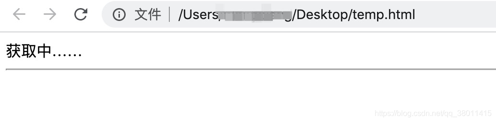

# Jd-Pruchase-Kill

### 扫码登陆

 Start.class是程序入口


### 需要设置

     商品id pid;
     
     eid = "";
     
     fp = "";

商品id为商品详情url中的一串数字

eid以及fp在订单结算页面 https://trade.jd.com/shopping/order/getOrderInfo.action

F12打开console，输入_JdTdudfp


或者F12打开Sources，添加_JdTdudfp参数


为了避免大家采坑，亲测，以下两种方式都可以成功获取。

# 方式一

1. chrome打开网站首页
2. 登录
3. 找任意一款商品打开详情
4. 在当前页面 F12 打开开发者工具
5. 在Console输入`_JdEid` 对应的就是eid, 输入 `_JdJrTdRiskFpInfo` 对应的就是fp。

# 方式二 通过动的HTML脚本

1. 新建html文件，将如下内容复制到文件
2. chrome打开文件

```html
<html>
    <head></head>
    <body>
        <div id="info">获取中……</div>
        <hr>
        <div id="eid"></div>
        <div id="fp"></div>
    </body>
</html>
<script src="https://gias.jd.com/js/td.js"></script>
<script>
    setTimeout(function () {
        try {
            getJdEid(function (eid, fp, udfp) {
                document.getElementById('info').innerText = '请把下面的内容复制到配置文件 config.ini 中的对应位置';
                document.getElementById('eid').innerText = 'eid = ' + eid;
                document.getElementById('fp').innerText = 'fp = ' + fp;
            });
        } catch (e) {
            document.getElementById('info').innerText = e;
        }
    }, 1000);
</script>
```





